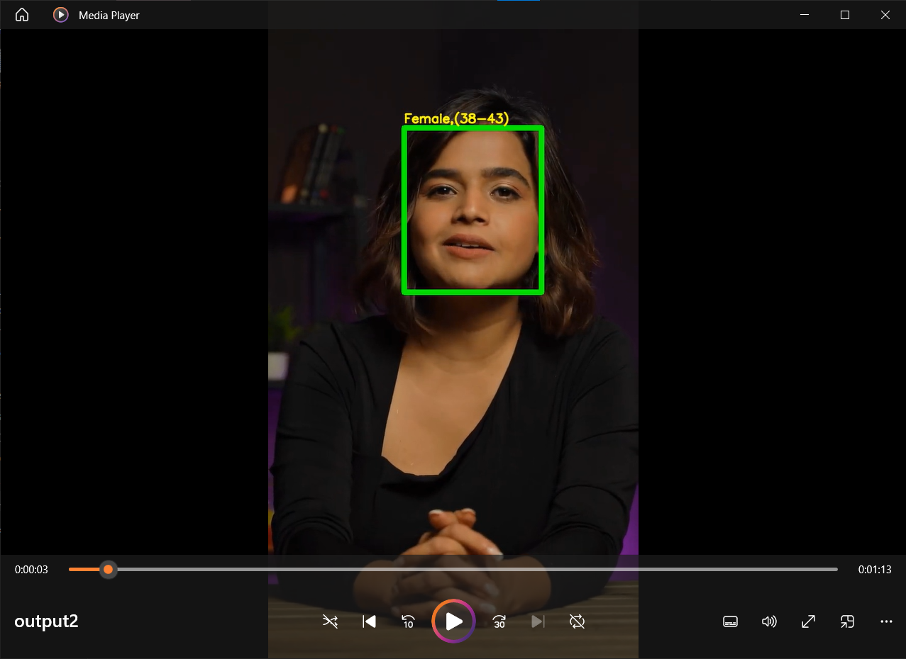

# Age and Gender Detection System



This project is a real-time age and gender detection system that uses deep learning models from Caffe and OpenCV for efficient image and video processing.

## About Caffe Deep Learning Framework
Caffe is a deep learning framework that was popular in the early days of deep learning, although it has been largely replaced by more modern frameworks like TensorFlow and PyTorch. However, Caffe still has some useful models and pre-trained networks, including those for face detection.
To run the notebook in your computer you have to download the `modelNweight.zip` and extract it to the same directory.
[modelNweight.zip](https://drive.google.com/uc?id=1_aDScOvBeBLCn_iv0oxSO8X1ySQpSbIS)

## Project Overview

This system utilizes pre-trained deep learning models to predict the age range and gender of individuals from images and video feeds. It uses a face detection model to identify faces in the input, and then applies the age and gender models to generate predictions for each detected face.

## Features

- Detects faces and classifies age and gender in real-time.
- Supports image and video inputs for age and gender detection.
- Provides output with bounding boxes and labels indicating age group and gender.

## Technologies Used

- **OpenCV**: For image processing and face detection.
- **Caffe**: Deep learning framework used for age and gender classification models.
- **Python**: Primary programming language.


## How It Works

1. **Face Detection**: The system uses OpenCV's DNN face detection model to locate faces in the input frame.
2. **Age and Gender Prediction**: Caffe models are applied to the detected faces to predict age range and gender.
3. **Visualization**: Detected faces are annotated with bounding boxes and labels showing predicted age and gender.

## Model Files

The following files are needed to run the model:

- **Face Detection Model**:
  - `opencv_face_detector.pbtxt`
  - `opencv_face_detector_uint8.pb`
- **Age Detection Model**:
  - `age_deploy.prototxt`
  - `age_net.caffemodel`
- **Gender Detection Model**:
  - `gender_deploy.prototxt`
  - `gender_net.caffemodel`

## Example Usage

### On Images

```python
inputImg = cv.imread("sample_test_images/sample_image.jpg")
outputImg = age_gender_detector(inputImg)
plt.imshow(cv.cvtColor(outputImg, cv.COLOR_BGR2RGB))
plt.show()

